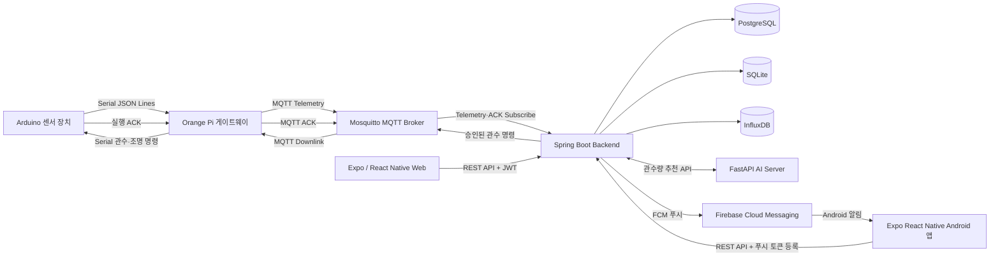
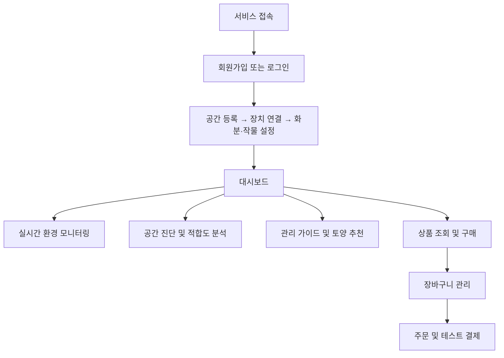
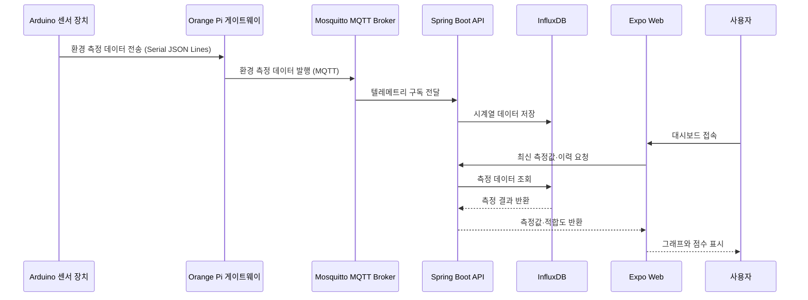
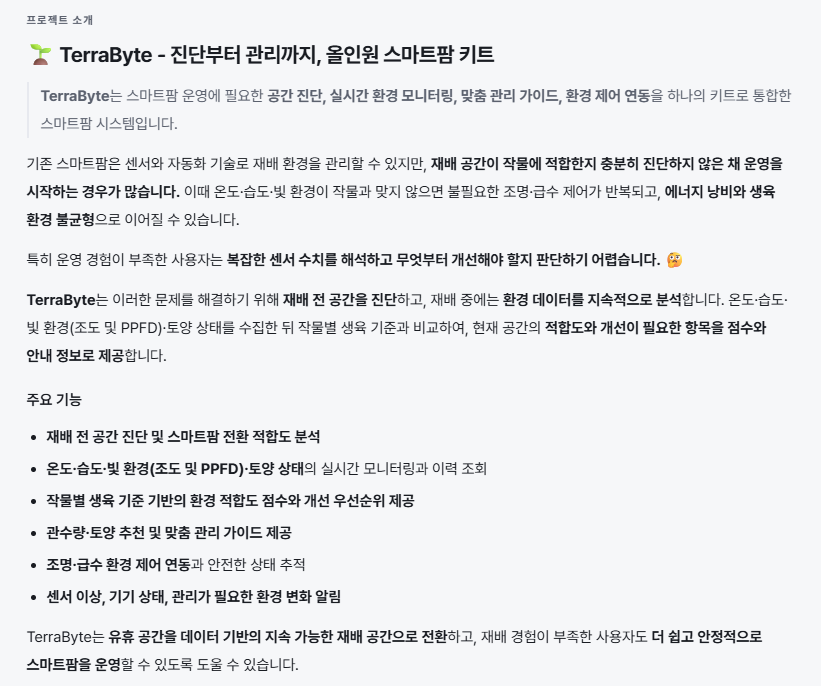

#  TerraByte 


## 1. 프로젝트 소개

### 1.1. 개발배경 및 필요성

기후 위기와 식량 안보 문제로 스마트팜에 대한 관심이 높아지면서, 옥상·지하 공간·공실 등 도심 유휴 공간을 농업 생산 공간으로 활용하려는 시도도 늘고 있습니다. 그러나 기존 스마트팜 솔루션은 구축 이후의 환경 제어와 모니터링에 주로 초점을 맞추고 있어, 설비 투자 이전에 후보 공간이 작물 재배에 적합한지 판단하기 어렵습니다.

공간 특성을 충분히 고려하지 않은 설비 투자는 불필요한 초기 비용과 에너지 사용량 증가로 이어질 수 있습니다.

**TerraByte는 설치 전 환경 데이터를 수집해 작물별 생육 기준과 비교함으로써 후보 공간의 적합성을 진단하고, 설치 후에도 동일한 플랫폼에서 재배 환경을 지속적으로 모니터링할 수 있도록 개발한 서비스입니다.**
<br/>
<br/>

### 1.2. 개발목표 및 주요내용

TerraByte의 목표는 도심 유휴 공간의 스마트팜 전환 가능성을 데이터로 진단하고, 구축 이후의 환경 모니터링까지 연결하는 것입니다.

- 단일 하드웨어 키트에서 대기 온습도와 조도를 측정하고, 센서 구성·보정 완료 시 PPFD·토양 온도·토양 수분을 추가 측정
- 센서 장치가 측정한 온도, 습도, 조도 및 구성된 센서의 PPFD·토양 데이터를 수집
- 수집한 측정값과 작물별 권장 생육 범위를 비교한 환경 적합도 계산
- 사용자, 재배 공간, 장치, 화분 정보를 연계한 통합 관리
- 최신 센서값과 측정 이력을 확인할 수 있는 웹 대시보드 제공
- 토양 프로필을 기반으로 한 추천 정보 제공
- 복잡한 환경 데이터를 점수, 그래프, 색상과 관리 지침으로 변환하여 비전문가의 재배 위험 감소
- AI 기반 관수량 추천과 맞춤 관리 가이드 제공
<br/>

### 1.3. 세부내용

#### 사용자 요구사항

- 스마트팜 설치 전 후보 공간이 작물 재배에 적합한지 쉽게 판단할 수 있어야 합니다.
- 재배 중인 공간의 환경 상태와 변화 추이를 한 화면에서 확인할 수 있어야 합니다.
- 작물별 적합도와 토양 추천 정보를 바탕으로 재배 관리 결정을 내릴 수 있어야 합니다.
- 재배 공간, 장치, 화분 정보를 연계하여 통합 관리할 수 있어야 합니다.

#### 기능 요구사항

- 회원가입·로그인 및 JWT 기반 사용자 인증
- 재배 공간, 장치, 화분 등록 및 조회
- 대기 온습도, 조도 및 구성된 센서의 PPFD·토양 온도·토양 수분 텔레메트리 수집과 시계열 데이터 저장
- 장치·화분별 최신 측정값 및 측정 이력 조회
- 작물별 환경 기준에 따른 항목별 점수와 종합 적합도 계산
- 토양 추천 정보 및 적합도 계산 기준 제공
- Expo Web 기반 사용자 화면과 Storybook 기반 UI 컴포넌트 관리
- Swagger UI를 통한 API 명세 확인
- 상품 카탈로그 조회와 장바구니 관리, 주문 생성 및 취소 기능 제공
- 토스페이먼츠 테스트 결제를 통한 주문 결제와 결제 취소 처리 제공
- 안전 게이트를 거치는 수동·자동 관수, 관수 이력 조회와 AI 기반 관수량 추천 제공
- 환경 분석 결과를 바탕으로 한 맞춤 관리 가이드 제공
- Android FCM 푸시 알림과 알림함을 통한 센서 이상·장치 오프라인·관수 완료 상태 안내
<br/>

### 1.4. 기존 서비스(상품) 대비 차별성

- 스마트팜 구축 이후뿐 아니라 설치 이전의 후보 공간 진단을 지원합니다.
- 단순 센서 수치 나열이 아니라 작물별 권장 범위와의 차이를 점수로 제공합니다.
- 하나의 통합 키트로 공간 분석과 토양 상태 측정을 수행하고, 진단 데이터와 실제 재배 단계의 모니터링 데이터를 한 서비스에서 연계합니다.
- PostgreSQL, SQLite, InfluxDB를 데이터 특성에 따라 분리하여 업무 데이터, 점수 기준, 센서 시계열 데이터를 관리합니다.
<br/>

### 1.5. 사회적가치 도입 계획

- 도심 유휴 공간의 농업적 활용 가능성을 데이터로 확인하여 도시 공간의 부가가치 창출을 지원합니다.
- 비전문가도 환경 상태와 개선 우선순위를 이해할 수 있도록 진입 장벽을 낮춥니다.
- 설치 전 진단을 통해 불필요한 설비 투자와 에너지 낭비를 줄이는 것을 목표로 합니다.
- 도심 농업 참여를 확대하여 지역 단위 로컬푸드 생태계 형성에 기여하는 것을 목표로 합니다.
<br/>

## 2. 상세설계

### 2.1. 시스템 구성도



| 구성 요소 | 역할 |
| --- | --- |
| Arduino 센서 장치 | 대기 온습도와 조도 측정, 구성·보정 완료 시 PPFD·토양 온도·토양 수분 추가 측정, 관수·조명 명령의 하드웨어 안전 인터록 적용 |
| Orange Pi 게이트웨이 | Arduino 시리얼 데이터 검증, 로컬 재전송 큐 관리, MQTT 텔레메트리 전송 및 MQTT-시리얼 관수 명령 중계·ACK 전송 |
| Expo Web | 사용자 인증, 장치·화분 관리, 측정값·적합도·관리 가이드 시각화 |
| Spring Boot | REST API, 인증, 데이터 처리, 환경 점수 계산, 관수 안전 게이트, 승인 명령 발행 및 ACK 상태 추적 |
| FastAPI AI Server | 관수 필요 여부와 분리된 관수량 추천; 오류 시 백엔드가 안전한 폴백 적용 |
| Firebase Cloud Messaging | 센서 이상·장치 오프라인 알림을 Android 앱으로 전송 |
| Mosquitto | Orange Pi 게이트웨이와 백엔드 간 텔레메트리·관수 명령·ACK MQTT 전송 및 ACL 기반 접근 제어 |
| PostgreSQL | 사용자, 공간, 장치 등 업무 데이터 저장 |
| SQLite | 작물별 점수 프로필과 계산 기준 데이터 저장 |
| InfluxDB | 센서 시계열 데이터 저장 및 조회 |
<br/>

### 2.2. 기술 스택

| 분야 | 기술 및 버전 | 활용 목적 및 상세 |
|:---:|:---|:---|
| **Frontend** | TypeScript v6.0 · React v19.2<br/>React Native v0.86 · Expo SDK 57 | 웹·모바일 공용 대시보드 화면 구현<br/>Storybook 기반 UI 컴포넌트 관리 |
| **Backend** | Java 17 · Docker JDK 21<br/>Spring Boot v3.5.16 · Gradle v8.14.3 | REST API, JWT 인증, 텔레메트리 수집<br/>작물별 환경 적합도 점수 계산<br/>토양 배지 추천 로직 |
| **Hardware<br/>& IoT** | C/C++ · Arduino · Python | 센서 펌웨어 — 대기 온습도·조도 기본 측정<br/>구성·보정 시 PPFD·토양 온도·토양 수분 추가 측정<br/>Orange Pi 엣지 서비스, 재전송 큐 |
| **AI Service** | Python v3.12 · FastAPI · scikit-learn | 관수 필요 여부와 분리된 관수량 추천 API<br/>모델 오류·미가용 시 백엔드 폴백 |
| **Database** | PostgreSQL v17 · InfluxDB v2.7 · SQLite | 사용자·공간·장치·화분 등 업무 데이터<br/>센서 시계열 데이터 저장 및 조회<br/>작물별 점수 프로필과 계산 기준 |
| **Infra** | Docker Compose v2 · Nginx v1.27 · Node.js v24 | 개발·배포 스택 일괄 실행<br/>정적 번들 서빙 및 API 프록시 |
| **AI<br/>Coding Tools** | GitHub Copilot · ChatGPT Codex<br/>Claude · Gemini | 코드 리뷰, 예외 처리 및 보안 점검<br/>설계 문서·API 명세 작성 보조<br/>API 구현, DB 스키마 및 인프라 설정 생성<br/>UI 컴포넌트 프로토타이핑 |
| **IDE &<br/>협업** | GitHub · IntelliJ IDEA · CLion · VS Code | 버전 관리 및 팀 협업<br/>개발 환경 (백엔드, 프론트엔드, 펌웨어) |
<br/>
<br/>

## 3. 개발결과

### 3.1. 전체시스템 흐름도
- 사용자 플로우 차트



- 시스템 플로우 차트


<br/>

### 3.2. 기능설명

#### `회원가입 및 로그인`

- 이메일, 비밀번호, 닉네임을 입력해 계정을 생성합니다.
- 이메일 형식과 비밀번호 조건을 검증합니다.
- 로그인 성공 시 발급받은 JWT를 이후 API 요청에 사용합니다.
<br/>

#### `초기 설정 및 장치 등록`

- 로그인한 사용자가 재배 공간과 장치를 등록합니다.
- 장치 코드와 공간 정보를 사용자 계정에 연결합니다.
- 등록한 장치와 화분 정보를 조회할 수 있습니다.
<br/>

#### `실시간 환경 대시보드`

- 온도, 습도, 조도의 최신 측정값과 구성·보정된 PPFD·토양 센서값을 표시합니다.
- 측정 이력을 조회하여 환경 변화를 확인합니다.
- 센서 데이터가 없는 항목은 임의의 0이 아니라 값이 없는 상태로 처리합니다.
<br/>

#### `공간 적합도 분석`

- 최근 24시간 유효 온도·습도·PPFD 측정값의 산술평균과 작물별 권장 환경 범위를 비교합니다.
- 평균 측정값을 항목별 0~100점으로 환산하고, 온도·습도·PPFD 점수의 동일 가중 기하평균으로 종합 적합도를 계산합니다.
- 토양 수분·토양 온도는 개별 상태로 제공하며 종합 적합도에는 포함하지 않습니다.
- 적합도 계산 기준을 화면에서 확인할 수 있습니다.
<br/>

#### `토양 추천`

- 장치 또는 화분에 연결된 환경 정보를 기준으로 토양 추천 정보를 조회합니다.
<br/>

#### `맞춤 관리 가이드`

- 환경 적합도, 최근 측정값, 토양 추천 및 상품 정보를 바탕으로 관리 우선순위와 실행 항목을 제공합니다.
<br/>

#### `관수 요청 및 관수량 추천`

- 수동 관수 요청과 자동 관수 규칙은 쿨다운·일일 한도·측정값 유효성 등의 안전 게이트를 거쳐 승인 또는 거부됩니다.
- 자동 제어가 활성화된 온라인 화분은 기본 1분마다 확인합니다. 기본 설정에서 토양 수분이 35% 미만이면 관수를 요청하며, 실제 실행 여부·용량·간격은 안전 게이트가 최종 판단합니다.
- AI 서버는 관수 필요 여부를 판단하지 않고 권장 관수량만 제안하며, 사용할 수 없을 때는 백엔드가 폴백 값을 적용합니다.
- 승인된 명령은 MQTT와 Orange Pi를 거쳐 Arduino로 전달되며, 실행 ACK에 따라 명령 상태를 추적합니다.
- Arduino는 최대 실행 시간 등 하드웨어 안전 인터록을 적용하며, 화분별 관수 결정 이력을 조회할 수 있습니다.
- 백엔드 heartbeat가 15분간 끊기면 Orange Pi는 토양 수분 15% 미만일 때만 60mL 긴급 관수를 수행합니다. 최소 12시간 간격과 하루 120mL 한도를 적용하고, 복구 뒤에는 관수 기록을 동기화한 후 서버 명령을 다시 받습니다.
<br/>

#### `조명 제어`

- 실시간 모니터링 화면에서 화분별 조명을 수동으로 켜고 끄는 요청을 보낼 수 있습니다.
- 자동 제어는 기본 06:00~22:00 광주기 안에서 작물별 PPFD 적정 범위를 기준으로 조명을 켜고 끕니다.
- 승인된 조명 명령은 MQTT와 Orange Pi를 거쳐 Arduino로 전달되며, 장치의 안전 인터록 범위 안에서 실행됩니다.
<br/>

#### `알림함 및 Android 푸시 알림`

- 센서 유효성 이상, 기기 오프라인, 펌프의 `completed` ACK 기반 관수 완료 이벤트를 알림함에서 확인하고 읽음 처리할 수 있습니다.
- Firebase를 설정한 Android 네이티브 앱에서는 같은 이벤트를 FCM 푸시 알림으로 수신할 수 있습니다.
<br/>

#### `상품 구매 및 결제`

- 상품 카탈로그를 조회하고 장바구니에 상품을 담아 수량을 관리합니다.
- 주문을 생성·취소하고, 토스페이먼츠 테스트 결제를 통해 결제 및 결제 취소를 처리합니다.
<br/>

### 3.3. 기능명세서

| 구분 | 기능 | 상세 |
|:---:|:---|:---|
| S1 | 회원가입 | 이메일, 비밀번호, 닉네임 입력값 검증 후 계정 생성 |
| S2 | 로그인 | 이메일과 비밀번호 검증 후 JWT 발급 |
| S3 | 사용자 정보 조회 | 인증된 사용자의 기본 정보 조회 |
| S4 | 재배 공간 관리 | 사용자의 재배 공간 등록 및 목록 조회 |
| S5 | 장치 관리 | 장치 코드 등록, 목록 및 상세 정보 조회 |
| S6 | 화분 관리 | 사용자에게 연결된 화분 목록 및 상세 정보 조회 |
| S7 | 텔레메트리 수집 | 장치 키를 검증하고 센서 측정값 수신 |
| S8 | 최신 측정값 조회 | 장치 또는 화분의 최신 센서값 조회 |
| S9 | 측정 이력 조회 | 지정한 기간의 센서 시계열 데이터 조회 |
| S10 | 환경 적합도 | 작물별 기준을 적용한 항목별·종합 점수 조회 |
| S11 | 토양 추천 | 장치 또는 화분 기준 토양 추천 정보 조회 |
| S12 | API 문서 | Swagger UI와 OpenAPI 문서 제공 |
| S13 | 상품 및 장바구니 | 상품 카탈로그 조회와 장바구니 상품 추가·수정·삭제 |
| S14 | 주문 및 결제 | 주문 생성·조회·취소와 토스페이먼츠 테스트 결제·취소 |
| S15 | 상거래 관리자 API | 상품·재고 관리와 주문 상태 변경 |
| S16 | 맞춤 관리 가이드 | 환경 분석 결과를 바탕으로 관리 우선순위·실행 항목·추천 상품 제공; AI 미설정 시 기본 가이드 표시 |
| S17 | 관수 요청 및 이력 | 안전 게이트를 거치는 수동·자동 관수, 오프라인 긴급 관수와 화분별 관수 결정 이력 조회 |
| S18 | AI 관수량 추천 | FastAPI 서버가 권장 관수량을 제안하고, 오류·미가용 시 백엔드가 폴백 적용 |
| S19 | 조명 제어 | 수동 조명 요청과 광주기·작물별 PPFD 범위 기반 자동 조명 제어, MQTT·Orange Pi·Arduino 연동 및 안전 인터록 적용 |
| S20 | 알림함 및 Android 푸시 알림 | 센서 이상·기기 오프라인·관수 완료 알림 조회 및 읽음 처리, Firebase 설정 시 Android FCM 푸시 전송 |
<br/>

### 3.4. 디렉토리 구조

```text
├── ai-server/                # FastAPI 관수량 추천 API, 모델, 학습·테스트 도구
├── backend/                  # Spring Boot API, DB 마이그레이션, 자동 테스트
│   ├── db/                   # SQLite 스키마와 마이그레이션
│   ├── gradle/               # Gradle Wrapper
│   └── src/                  # 백엔드 소스와 테스트
├── frontend/
│   └── app/                  # Expo 앱, 화면·컴포넌트, Storybook
├── edge/
│   ├── arduino/              # 센서 보드 펌웨어
│   ├── fusion_scripts/       # Fusion 360 스마트팜 프로토타입 모델링 스크립트
│   └── pi/                   # Orange Pi 수집·전송 코드
├── infra/
│   └── mosquitto/            # 개발용 MQTT 브로커 설정과 ACL
├── docs/                     # 설계, 개발 환경, 프로젝트 문서
├── docker-compose.yml        # 개발용 Docker Compose 스택
├── docker-compose.prod.yml   # 프로덕션 유사 Docker Compose 스택
├── .env.example              # 로컬 환경 변수 예시
└── Makefile                  # 개발 명령 단축키
```
<br/>

### 3.5. AI 도구 활용

- GitHub Copilot을 실시간 코드 작성 보조, 반복 코드 생성, 예외 처리 검토에 활용했습니다.
- OpenAI Codex를 저장소 분석, 구현 작업, 문서 검토 보조에 활용했습니다.
- ChatGPT와 Claude를 기술 문서 및 API 명세 작성, 설계 대안 검토, 코드 리뷰에 활용했습니다.
- Gemini를 구현 아이디어와 데이터 처리 방식 검토에 활용했습니다.
- v0.dev를 대시보드 화면과 UI 컴포넌트 프로토타이핑에 활용했습니다.
- 생성된 결과를 그대로 반영하지 않고 기존 코드 구조, API 계약, 테스트 결과를 기준으로 검토했습니다.
<br/>

## 4. 설치 및 사용 방법

Docker를 사용하면 Java, Gradle, Node.js, Python, PostgreSQL, InfluxDB를 호스트에 별도로 설치하지 않아도 됩니다. Docker Compose v2와 Buildx가 필요합니다.

### 4.1. Docker 설치

#### Windows 10/11

1. [Docker Desktop for Windows 공식 설치 안내](https://docs.docker.com/desktop/setup/install/windows-install/)에서 설치 파일을 내려받아 실행합니다.
2. WSL이 설치되어 있지 않다면 관리자 PowerShell에서 `wsl --install`을 실행한 뒤 재부팅합니다.
3. Docker Desktop에서 WSL 2 기반 엔진과 사용할 WSL 배포판 연동을 활성화합니다.
4. Linux 컨테이너 모드인지 확인합니다.

#### macOS

1. [Docker Desktop for Mac 공식 설치 안내](https://docs.docker.com/desktop/setup/install/mac-install/)에서 Mac 칩에 맞는 설치 파일을 내려받습니다.
2. Docker를 Applications로 옮겨 실행하고 초기 설정을 완료합니다.

Homebrew를 사용하는 경우:

```bash
brew install --cask docker
```

#### Ubuntu Linux

[Docker Engine 공식 Ubuntu 설치 안내](https://docs.docker.com/engine/install/ubuntu/)에 따라 Docker의 apt 저장소를 먼저 등록한 뒤 아래 패키지를 설치합니다.

```bash
sudo apt update
sudo apt install docker-ce docker-ce-cli containerd.io docker-buildx-plugin docker-compose-plugin
sudo systemctl enable --now docker
sudo docker run --rm hello-world
```

일반 사용자로 Docker를 실행하려면 사용자를 `docker` 그룹에 추가한 뒤 다시 로그인합니다.

```bash
sudo usermod -aG docker "$USER"
```

설치 확인:

```bash
docker --version
docker compose version
docker buildx version
docker run --rm hello-world
```
<br/>

### 4.2. 저장소 받기

```bash
git clone https://github.com/PNU-2026-AI-Hackathon/pnuai-b-02-terrabyte.git
cd pnuai-b-02-terrabyte
```
<br/>

### 4.3. Make를 사용해 한 번에 실행(권장)

macOS, Linux 또는 Make가 설치된 Windows 환경에서는 아래 한 줄을 실행합니다. `.env`가 없으면 자동으로 생성하고 전체 개발 스택을 백그라운드에서 빌드·실행합니다.

```bash
make up-d
```
<br/>

### 4.4. Docker Compose로 직접 한 번에 실행

Make가 없는 환경에서는 사용하는 셸에 맞는 명령을 실행합니다.

macOS/Linux:

```bash
test -f .env || cp .env.example .env; docker compose up -d --build
```

Windows PowerShell:

```powershell
if (!(Test-Path .env)) { Copy-Item .env.example .env }; docker compose up -d --build
```

`.env.example`의 계정과 비밀키는 로컬 개발 전용입니다. 외부에 공개되는 환경에서는 반드시 안전한 값으로 교체해야 합니다.

실제 Arduino·Orange Pi 장치로 승인된 관수 명령을 전달하려면 `.env`에 아래 값을 추가한 뒤 스택을 다시 시작합니다. 기본값은 `false`이며, 이 경우 관수 요청은 기록되지만 MQTT 명령을 실제 장치로 발행하지 않습니다.

```dotenv
MQTT_COMMAND_DISPATCH_ENABLED=true
```
<br/>
<br/>

### 4.5. 실행 확인

| 서비스 | 주소 |
| --- | --- |
| 프론트엔드 | http://localhost:8081 |
| 백엔드 상태 확인 | http://localhost:8080/actuator/health |
| Swagger UI | http://localhost:8080/swagger-ui.html |
| InfluxDB UI | http://localhost:8086 |
| Mosquitto MQTT | `localhost:1883` |
| PostgreSQL | `localhost:5432` |
| 백엔드 원격 디버그 | `localhost:5005` |

```bash
make ps
make logs

# Make를 사용하지 않는 경우
docker compose ps
docker compose logs -f
```

백엔드와 InfluxDB 상태 확인:

```bash
curl --fail http://localhost:8080/actuator/health
curl --fail http://localhost:8086/health
```
<br/>

### 4.6. 테스트

백엔드 전체 자동 테스트:

```bash
make test
```

Make를 사용하지 않는 경우:

```bash
docker compose run --rm --no-deps \
  -e GRADLE_USER_HOME=/home/dev/.gradle/one-shot \
  backend --project-cache-dir /home/dev/.gradle/one-shot-project test
```

프론트엔드 TypeScript 검사와 Storybook 정적 빌드:

```bash
docker compose exec frontend npx tsc --noEmit
docker compose exec frontend npm run build-storybook
```

API 스모크 테스트:

```bash
curl -i -X POST http://localhost:8080/api/auth/signup \
  -H 'Content-Type: application/json' \
  -d '{"email":"docker-test@terrabyte.local","password":"password1","nickname":"Docker Test"}'

curl -i -X POST http://localhost:8080/api/auth/login \
  -H 'Content-Type: application/json' \
  -d '{"email":"docker-test@terrabyte.local","password":"password1"}'
```
<br/>

### 4.7. 자주 사용하는 명령

| 작업 | Make 사용 | Docker Compose 직접 사용 |
| --- | --- | --- |
| 환경 파일 준비 | `make init` | `cp .env.example .env` |
| 포그라운드 실행 | `make up` | `docker compose up --build` |
| 백그라운드 실행 | `make up-d` | `docker compose up -d --build` |
| 상태 확인 | `make ps` | `docker compose ps` |
| 전체 로그 | `make logs` | `docker compose logs -f` |
| 백엔드 로그 | `make logs-backend` | `docker compose logs -f backend` |
| 백엔드 재시작 | `make restart` | `docker compose restart backend` |
| 캐시 없이 재빌드 | `make rebuild` | `docker compose build --no-cache` |
| 백엔드 테스트 | `make test` | 4.6절의 전체 명령 |
| 중지 | `make down` | `docker compose down` |
| 중지 및 DB 초기화 | `make down-v` | `docker compose down -v` |

`docker compose down -v`와 `make down-v`는 PostgreSQL·InfluxDB 데이터와 Mosquitto의 retained 메시지·로그 볼륨을 삭제하므로 초기화가 필요할 때만 사용합니다.
<br/>
<br/>

### 4.8. 프로덕션 유사 스택

`.env`의 `POSTGRES_PASSWORD`, `INFLUX_PASSWORD`, `INFLUX_TOKEN`, `TELEMETRY_DEVICE_KEY`, `JWT_SECRET`을 안전한 값으로 변경한 뒤 실행합니다. 결제 기능을 활성화할 경우 `TOSS_PAYMENTS_ENABLED=true`와 토스페이먼츠 클라이언트 키·시크릿 키, 성공·실패 반환 URL도 운영 환경에 맞게 설정합니다.

```bash
make prod-up

# Make를 사용하지 않는 경우
docker compose -f docker-compose.prod.yml up -d --build
```

| 서비스 | 주소 |
| --- | --- |
| 프로덕션 유사 웹 | http://localhost:8088 |
| 상태 확인 | http://localhost:8088/actuator/health |

중지:

```bash
make prod-down

# Make를 사용하지 않는 경우
docker compose -f docker-compose.prod.yml down
```

더 자세한 원격 디버깅, DB 접속, 모바일 기기 연결 방법은 [Docker 개발·배포 환경 가이드](docs/docker_dev_environment.md)를 참고합니다.

### 4.9. Orange Pi 게이트웨이 상태판(GUI·웹·텍스트) 원격 실행

게이트웨이에 연결된 모니터에는 tkinter 전체화면 상태판을 표시할 수 있습니다. 브릿지(`terrabyte-edge.service`)가 1초마다 `/run/terrabyte-edge/status.json`에 상태를 쓰고, GUI·브라우저·텍스트 상태판은 이 파일을 읽습니다. 상태판에는 게이트웨이 등록 코드, 연결 상태, 대기열, 센서 상태와 최근 이벤트가 표시됩니다. 상태판 프로세스는 브릿지와 분리되어 있어 **상태판을 껐다 켜도 텔레메트리 수집·전송은 영향받지 않습니다.**

브라우저 상태판은 기본적으로 `127.0.0.1:8090`에서 실행합니다. 다른 기기에서 열려면 `--host 0.0.0.0`을 명시해야 하며, 인증이 없으므로 신뢰할 수 있는 네트워크에서만 사용합니다.

```bash
cd /opt/terrabyte-edge

# 브라우저 상태판: http://127.0.0.1:8090
.venv/bin/python -m terrabyte_edge status

# SSH 터미널용 텍스트 상태판
.venv/bin/python -m terrabyte_edge status --text --watch 2
```

#### 4.9.1. SSH 접속

공개키를 한 번 등록해 두면 이후에는 비밀번호 없이 접속합니다.

```bash
ssh-copy-id -i ~/.ssh/terrabyte_orangepi_ed25519.pub root@192.168.50.27   # 최초 1회
ssh -i ~/.ssh/terrabyte_orangepi_ed25519 root@192.168.50.27
```

#### 4.9.2. 실행 전 확인

상태판은 데스크톱 세션의 X 서버에 창을 띄우므로 아래가 모두 참이어야 합니다.

```bash
pgrep -a Xorg                        # X 서버(:0)가 떠 있는가
systemctl is-active terrabyte-edge   # active
ls -l /run/terrabyte-edge/status.json
python3 -c "import tkinter; print(tkinter.TkVersion)"
```

`DISPLAY`와 `XAUTHORITY`는 추측하지 말고 데스크톱 세션 소유자(`orangepi`)의 실제 값을 읽어옵니다.

```bash
pid=$(pgrep -u orangepi -f xfce4-session | head -1)
tr '\0' '\n' < /proc/$pid/environ | grep -E '^(DISPLAY|XAUTHORITY)='
# DISPLAY=:0
# XAUTHORITY=/home/orangepi/.Xauthority
```

#### 4.9.3. 상태판 띄우기

`root`로 접속한 뒤 데스크톱 세션 사용자로 전환해 실행합니다. `setsid --fork`를 쓰면 SSH 세션이 프로세스를 붙잡지 않고 바로 반환됩니다.

```bash
runuser -u orangepi -- sh -c 'cd /opt/terrabyte-edge && \
  exec setsid --fork env DISPLAY=:0 XAUTHORITY=/home/orangepi/.Xauthority \
  .venv/bin/python -m terrabyte_edge dashboard \
  >/tmp/tb-dash.log 2>&1 </dev/null'
```

`cd /opt/terrabyte-edge`는 생략할 수 없습니다. 패키지가 venv에 설치되어 있지 않고 소스 디렉터리를 작업 디렉터리로 두고 `-m`으로 실행하는 구조라, 생략하면 `No module named terrabyte_edge`가 납니다.

확인과 종료:

```bash
pgrep -af 'terrabyte_edge dashboard'
cat /tmp/tb-dash.log        # 비어 있으면 정상 기동
pkill -f 'terrabyte_edge dashboard'
```

`pkill -f`를 `ssh host '...'` 한 줄 안에서 다른 명령과 함께 쓰면 원격 셸 자신의 명령줄에도 그 문자열이 들어 있어 셸이 스스로를 죽이고 SSH가 255로 끊깁니다. 종료는 별도 명령으로 실행하거나 PID를 지정합니다.

개발 중에는 전체화면 대신 창 모드로 띄울 수 있습니다.

```bash
.venv/bin/python -m terrabyte_edge dashboard --windowed
```

#### 4.9.4. 부팅 시 자동 실행

`.desktop` 파일을 autostart에 넣으면 데스크톱 로그인 5초 뒤 자동으로 뜹니다.

```bash
sudo cp /opt/terrabyte-edge/deploy/terrabyte-dashboard.desktop /etc/xdg/autostart/
```

#### 4.9.5. 원격에서 화면 확인

모니터 앞에 가지 않고 실제 렌더링을 확인하려면 스크린샷을 찍어 가져옵니다.

```bash
ssh -i ~/.ssh/terrabyte_orangepi_ed25519 root@192.168.50.27 \
  'su orangepi -c "DISPLAY=:0 XAUTHORITY=/home/orangepi/.Xauthority \
   xfce4-screenshooter -f -s /tmp/tb-shot.png"'
scp -i ~/.ssh/terrabyte_orangepi_ed25519 root@192.168.50.27:/tmp/tb-shot.png .
```

#### 4.9.6. 문제 해결

| 증상 | 원인 | 조치 |
| --- | --- | --- |
| `No module named terrabyte_edge` | `cd /opt/terrabyte-edge` 누락 | 실행 전 해당 디렉터리로 이동 |
| SSH 명령이 끝나지 않고 매달림 | 백그라운드 프로세스가 SSH 채널의 stdout/stderr를 잡고 있음 | `setsid --fork`와 `>파일 2>&1 </dev/null`을 함께 사용 |
| root인데도 `/tmp/...: Permission denied` | `fs.protected_regular`가 sticky 디렉터리에서 타 사용자 소유 파일 열기를 차단 | 리다이렉션을 `runuser ... sh -c '...'` 안쪽에서 수행 |
| 화면은 뜨는데 모든 화분이 `연결 대기` | Arduino 프레임 미수신 | `journalctl -u terrabyte-edge -f`에서 `serial` 경고 확인 |
| 로그에 `discarding incomplete serial message` 반복 | 보드가 보내는 보드레이트나 펌웨어가 계약과 다름 | 브릿지를 멈추고 여러 보드레이트로 원시 바이트를 덤프해 확인(4.9.7) |
| 상태판에 `브리지 서비스 응답 없음` | 스냅샷이 8초 이상 낡음 | `systemctl status terrabyte-edge` |

#### 4.9.7. 시리얼 원시 바이트 덤프

`frames=0`인데 원인을 모를 때는 브릿지를 잠시 멈추고 포트를 직접 읽는 것이 가장 빠릅니다. 포트는 배타적으로 열리므로 브릿지가 켜져 있으면 읽을 수 없습니다.

```bash
systemctl stop terrabyte-edge
/opt/terrabyte-edge/.venv/bin/python - <<'PY'
import time, serial
port = "/dev/serial/by-id/usb-1a86_USB_Serial-if00-port0"
for baud in (9600, 57600, 115200):
    s = serial.Serial(port=port, baudrate=baud, timeout=1)
    s.reset_input_buffer(); t0 = time.time(); buf = b""
    while time.time() - t0 < 5:
        buf += s.read(4096)
    s.close()
    printable = sum(1 for b in buf if 32 <= b < 127)
    print(f"baud={baud:6d} total={len(buf):6d} nulls={buf.count(0)} "
          f"printable={printable} sample={buf[:40]!r}")
PY
systemctl start terrabyte-edge
```

읽는 값이 전부 `\x00`이면 그 보드레이트가 틀린 것입니다. 사람이 읽을 수 있는 문자가 나오는 보드레이트가 보드의 실제 설정이며, 그 출력이 JSON Lines가 아니라면 텔레메트리 펌웨어가 아닌 다른 스케치가 올라가 있는 것입니다. 계약상 보드레이트는 115200이고 한 줄에 JSON 객체 하나입니다(`edge/arduino/include/TelemetryConfig.h`의 `TB_SERIAL_BAUD`).
<br/>
<br/>

## 5. 프로젝트 소개 및 시연 영상

- [TerraByte 바로가기](https://pnuai-b-02-terrabyte.vercel.app/)


> 한 눈에 보는 프로젝트 소개




> 시연 영상

[](https://www.youtube.com/watch?v=E_uX0AG3zqc)

<br/>

## 6. 팀 소개

| LEADER | MEMBER1 | MEMBER2 | MEMBER3 | MEMBER4 |
|:---:|:---:|:---:|:---:|:---:|
| [](https://github.com/cnvxlns) | [](https://github.com/oesmln) | [](https://github.com/iris11132-max) | [](https://github.com/7hyunii) | [](https://github.com/Reighnex) |
| 김동현 | 김민서 | 김효빈 | 문성현 | 박태훈 |
| okmac03@pusan.ac.kr | kmmlns@gmail.com | irisrla@naver.com | 7sonicx@gmail.com | pth4241@pusan.ac.kr |
| 하드웨어 연동,<br/>백엔드 개발, 배포 | 풀스택 개발 | 재배환경 데이터 기획,<br/>서비스 디자인 | 풀스택 개발,<br/>개발 협업 프로세스 구축·관리 | 모바일 앱 개발, 발표,<br/>클라우드 서비스 연동 |
<br/>

## 7. 해커톤 참여 후기

- 김동현
> 이번 해커톤을 통해 하드웨어를 직접 설계하고 구현해보면서, 앞으로 만들고 싶은 것이 생겼을 때 스스로 구현해낼 수 있다는 자신감을 얻었습니다. 또한 팀 리더로서 팀원들의 역량과 진행 상황을 고려해 태스크를 배분하는 과정에서 여러 시행착오를 겪었고, 이를 통해 협업과 리더십 측면에서도 성장할 수 있었습니다. 초기 계획과 비교하면 해커톤이 진행되는 동안 많은 부분이 수정되었지만, 변화에 맞춰 문제를 해결하고 결과물을 완성해가는 과정 자체가 값진 경험이었습니다.

- 김민서
> 스마트팜 분야를 처음 다뤄보면서 관련 지식이나 용어, 기술들을 많이 배울 수 있었습니다. 특히 하드웨어와 백엔드를 직접 연결해 보면서 센서에서 수집된 데이터가 서버로 전달되고 처리되는 과정을 경험할 수 있었고, 이 과정에서 많은 것을 배울 수 있었습니다.<br>처음 접하는 기술이나 익숙하지 않은 부분을 구현하는 과정에서는 AI 도구가 많은 도움이 되었습니다. 모르는 개념을 이해하거나 오류의 원인을 파악하고 해결 방법을 찾아가는 데 AI를 활용하면서 보다 효율적으로 개발을 진행할 수 있었습니다.<br>처음 접하는 분야를 다뤘던 만큼 어려운 점도 있었지만, 그만큼 새롭게 배우고 경험할 수 있는 부분도 많았습니다. 새로운 분야의 지식과 기술을 직접 이해하고 적용해 볼 수 있었다는 점에서 의미 있는 프로젝트였습니다.

- 김효빈
> 서로 다른 전공을 가진 분들과 소통하고 협업하는 경험이 처음이라 더욱 뜻깊었습니다. 이번 해커톤을 통해 하나의 프로젝트가 다양한 의견과 아이디어를 바탕으로 점차 구체화되고 완성되어 가는 과정을 직접 경험할 수 있었습니다. 특히 여러 사람의 아이디어가 모여 하나의 결과물로 이어지는 과정이 인상 깊었고, 협업의 중요성을 느낄 수 있었습니다. 실제 사용자의 관점에서 서비스를 바라보며, 작은 수정이 전체적인 사용성과 완성도를 높일 수 있다는 점을 배웠습니다. 기획과 디자인, 협업 과정 등 다양한 부분을 경험하며 여러 방면에서 성장할 수 있었던 좋은 기회였습니다. 언제나 이끌어주신 팀원분들께 감사드립니다! 

- 문성현
> 해커톤을 진행하면서 주어진 시간이 정말 짧다는 것을 뼈저리게 느꼈던 것 같습니다. 스마트팜이라는 익숙하지 않은 주제로 프로젝트를 진행하다 보니 초반에는 자료 조사와 기획에 생각보다 많은 시간이 필요했고, 프로젝트의 규모가 커지면서 협업 과정에서 서로의 진행 상황을 파악하고 작성한 코드를 이해하는 데에도 꽤 많은 시간이 들었던 것 같습니다. 또한 AI를 단순히 사용하는 것을 넘어, 어떻게 활용해야 프로젝트에 실질적인 도움이 될 수 있을지 공부하고 고민해 볼 수 있었던 시간이기도 했습니다. 짧은 시간이었지만 그만큼 많은 것을 배우고 경험할 수 있었던 의미 있는 시간이었습니다. 함께 고생한 팀원들 모두 정말 수고 많으셨습니다!!

- 박태훈
> 이전에는 스마트팜이 단순히 센서와 자동화 장비를 연결하는 기술적인 영역이라고만 생각했으나, 이번 해커톤으로 현장을 접하면서 실제 하드웨어 제작과 시스템 안정성 확보가 얼마나 까다로운지, 지속 가능한 사업성을 갖추기 위해 얼마나 다양한 요소를 복합적으로 고려해야 하는지 알 수 있었습니다. 특히 실제 기업이 구현하는 스마트팜의 실제 형태를 엿보고, 그 과정에서 겪는 기술적 한계와 운영상의 고충을 현업자에게 들어볼 수 있었습니다. 단순한 기능 구현을 넘어 현실적인 제약과 비즈니스 모델을 함께 고민해야 한다는 감각을 배울 수 있는 뜻깊은 시간이었습니다.

<br/>
