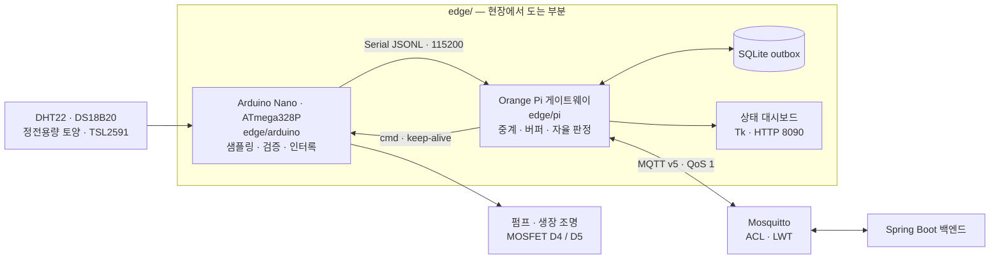
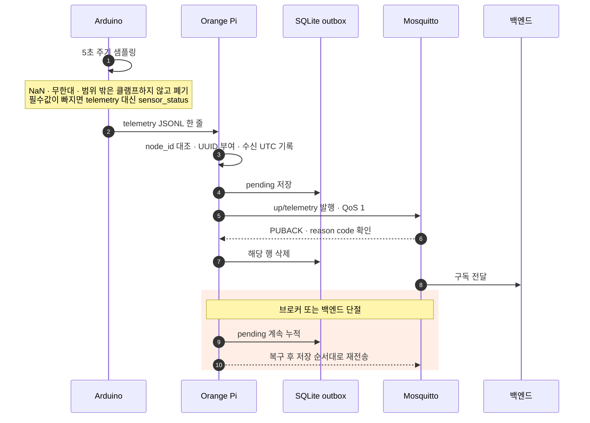
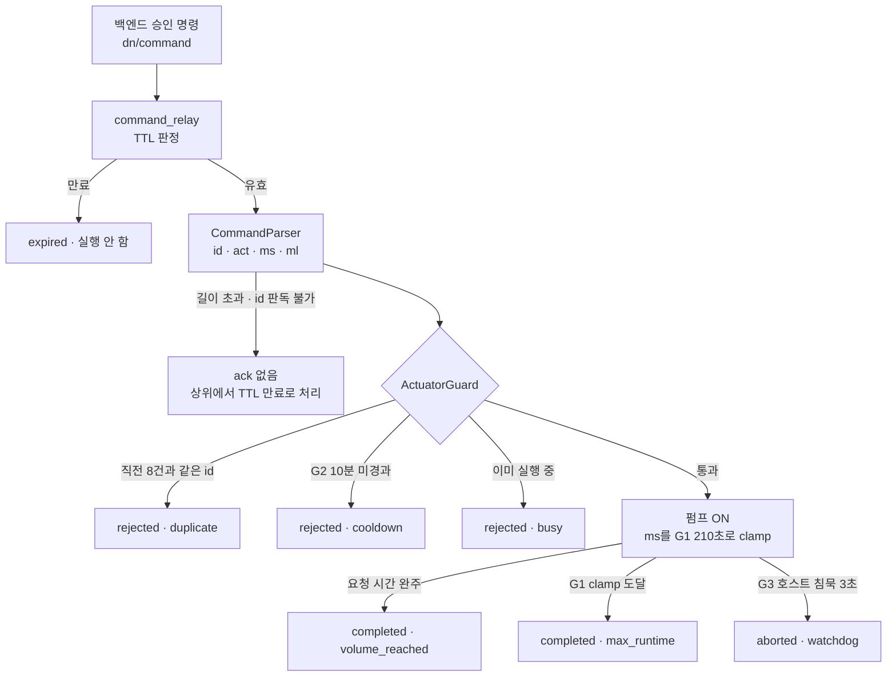
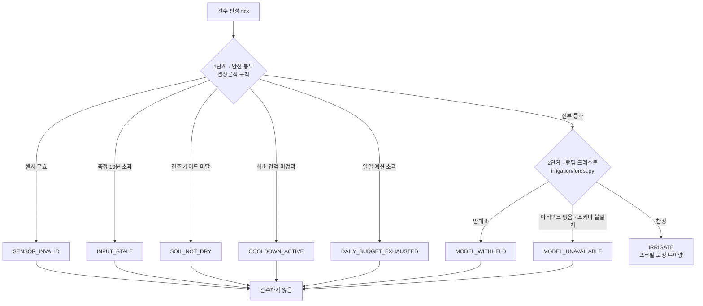

# TerraByte Edge — 현장 계층


`edge/`는 화분 옆에서 도는 모든 것입니다. 센서를 읽고, 값이 신뢰할 만한지 판단하고,
백엔드가 죽어 있는 동안에도 데이터를 잃지 않고 쌓아 두며, 승인된 관수·조명 명령을
하드웨어 인터록을 통과시켜 실행합니다. 클라우드가 완전히 끊긴 상황에서 식물을
살려 두는 마지막 자율 판정도 여기 있습니다.

이 문서는 엣지 계층 전체의 지도입니다. 각 부분의 상세는
[`arduino/README.md`](arduino/README.md)와 [`pi/README.md`](pi/README.md)에 있습니다.

---

## 1. 구성 요소 지도



| 경로 | 역할 | 언어 · 런타임 | 상세 |
| --- | --- | --- | --- |
| [`arduino/`](arduino) | 센서 펌웨어. 5초 주기 샘플링, 유효성 검사, JSONL 송신, 액추에이터 하드 인터록 | C++17 · Arduino AVR · PlatformIO | [README](arduino/README.md) |
| [`pi/`](pi) | 게이트웨이 서비스. 시리얼 검증, SQLite outbox, MQTT 발행, 명령 중계, 관수 판정, 상태판 | Python 3.10+ | [README](pi/README.md) |
| [`pi/tools/`](pi/tools) | 배포되지 않는 벤치 도구. 데이터셋 캡처, 유량 캠페인, 모델 재학습 | Python · scikit-learn / XGBoost | [README](pi/README.md) |
| [`fusion_scripts/`](fusion_scripts/SmartFarmPrototype) | 하우징 콘셉트 모델을 생성하는 Fusion 360 스크립트 | Python · Fusion API | [§6](#6-fusion-360-하우징-프로토타입) |

`arduino`와 `pi` 사이의 와이어 계약은 **양방향이 서로 다른 엔벌로프 키**를 씁니다.
업링크는 `message_type`, 다운링크는 `t`입니다. 2 KB SRAM 위에서 파서가 두 방향을
혼동하지 않게 하려는 의도적인 비대칭이며, 계약에 고정돼 있습니다.

---

## 2. 업링크 — 센서에서 클라우드까지



- **저장이 전송보다 먼저입니다.** outbox에 들어간 뒤에야 발행하므로, 발행 도중
  전원이 나가도 관측은 남습니다. UUID와 수신 UTC는 재전송 중에도 바뀌지 않습니다.
- **`node_id + sequence`는 영구 식별자가 아닙니다.** 아두이노 재부팅마다 0으로
  돌아가고 uint32로 wrap되기 때문에, 멱등성 키는 Orange Pi가 붙입니다.
- **MQTT는 v5입니다.** 3.1.1은 ACL로 거부된 발행에도 PUBACK을 돌려주므로,
  게이트웨이가 자기 네임스페이스 밖으로 잘못 발행하면 성공으로 보고되고 outbox에서
  지워져 데이터가 조용히 사라집니다. v5의 reason code로 이를 잡아 재시도합니다.
- **`dead` 격리는 로컬 스키마 검증 실패에만 적용합니다.** MQTT에는 HTTP 4xx에
  해당하는 응답이 없어 "영구히 잘못된 페이로드"와 "일시적 장애"를 구분할 수 없기
  때문입니다. 나머지는 전부 재시도이며 outbox가 순서를 보존합니다.
- **인증은 브로커가 담당합니다.** 각 게이트웨이 계정은 자기 `gatewayId` 아래에만
  발행할 수 있어(Mosquitto ACL), 백엔드는 토픽에서 뽑은 `gatewayId`를 신뢰합니다.

```text
tb/v2/{gatewayId}/up/telemetry    게이트웨이 → 서버   QoS 1, retain 안 함
tb/v2/{gatewayId}/up/status       온라인 상태, LWT     QoS 1, retain
tb/v2/{gatewayId}/dn/command      서버 → 게이트웨이     QoS 1, retain 절대 금지
```

`dn/command`를 retain하면 재접속할 때마다 오래된 관수 명령이 되살아납니다.
`TB_TRANSPORT=http`로 바꾸면 같은 envelope을 `POST /api/telemetry`로 보내지만,
디버그·폴백 경로이며 백엔드에서 기본 비활성입니다.

---

## 3. 다운링크 — 명령과 하드웨어 인터록



인터록은 펌웨어 안에 있습니다. **Orange Pi도, 브로커도, 클라우드도 전부 죽은 뒤에
마지막으로 남는 방어선**이기 때문이며, 어떤 인바운드 명령으로도 완화할 수 없습니다.

| # | 방어 | 기본값 | 동작 |
| --- | --- | --- | --- |
| G1 | 절대 최대 구동 시간 | `TB_PUMP_ABS_MAX_MS` 210 000 ms | 더 큰 `ms`는 clamp되고 `stop:"max_runtime"`으로 보고 |
| G2 | 최소 구동 간격 | `TB_PUMP_MIN_INTERVAL_MS` 600 000 ms | 마지막 정지 시점 기준, 이른 명령은 `rejected`·`r:"cooldown"` |
| G3 | 데드맨 워치독 | `TB_HOST_TIMEOUT_MS` 3 000 ms | 구동 중 호스트 침묵이 이만큼이면 정지, `aborted`·`stop:"watchdog"` |
| G4 | 부팅 안전 | — | `Serial.begin()`보다 앞, `setup()` 첫 문장에서 두 출력을 off로 구동 |

G1이 210초인 이유는 실측 유량이 0.98 mL/s(500 mL / 510 s)여서 서버의 200 mL 상한이
204 000 ms를 요구하기 때문입니다. 이보다 짧으면 모든 최대 투여가 잘려 나가면서
설정 오류가 하드웨어 고장처럼 보입니다.

### 조명은 투여가 아니라 래치입니다

`act:"led"`에는 지속 시간이 없습니다. G1~G3이 그대로 옮겨오지 않습니다.

| | 펌프 | 생장 조명 |
| --- | --- | --- |
| 절대 최대 구동 | G1 · 210초 | 없음 — 빛은 화분에 누적되지 않음 |
| 최소 간격 | G2 · 10분 | 없음 — 회복할 배지가 없음 |
| 데드맨 | G3 · 3초 | `TB_LED_HOST_TIMEOUT_MS` · 300초 |
| 명령 id 중복 제거 | 8칸 링 버퍼 | 없음 — 래치는 멱등 |

조명 id는 절대 펌프의 링에 들어가면 안 됩니다. 조명 전환 8번이면 펌프 id가 밀려나고,
`duplicate`로 거부됐어야 할 재전달 투여가 두 번 실행됩니다. `LedGuard`가
`ActuatorGuard` 안의 두 번째 래치가 아니라 별도 클래스인 이유입니다.

게이트웨이의 조명 keep-alive는 `TB_HOST_TIMEOUT_MS`보다 **느려야** 합니다. G3는
바이트만 셀 뿐 어느 액추에이터를 향한 것인지 모르므로, 1 Hz 조명 틱은 펌프의
데드맨까지 먹여 살려 고아 구동을 멈출 침묵을 없애 버립니다. 컴파일 타임 검사가
`TB_LED_HOST_TIMEOUT_MS > TB_HOST_TIMEOUT_MS`를 강제합니다.

펌웨어 밖으로 의도적으로 밀어낸 두 경계가 있습니다.

- **TTL** — 보드에 RTC가 없어 벽시계를 비교하지 않습니다. 상대 시간 `ms`만 다루고,
  만료 판단은 Orange Pi 몫입니다.
- **용량** — 유량계가 없어 투여는 계량이 아니라 계시입니다. `ml`은 보고용 라벨이며,
  워치독으로 중단된 투여에서는 `ms`와 의도적으로 어긋납니다. `ml`을 전달량으로 읽는
  분석은 **실패한 투여만 골라 과다 집계**합니다.

> ⚠️ **G1~G4와 중복 링, 조명 래치는 `test/` 유닛 테스트로 증명돼 있지만 실물 하드웨어로는
> 아직 검증되지 않았습니다.** 벤치 시나리오(210초 강제 정지, 구동 중 USB 분리, 중복 id,
> 즉시 재명령, 구동 중 리셋)가 미결이며, 2026-08-24 벤치에서 Orange Pi 한 대가 연기를
> 낸 원인이 규명되지 않아 **D4·D5에 12 V 부하를 연결하면 안 됩니다.** 표시용 LED나
> 저항 부하로 대체해도 유량 보정 두 건을 뺀 전부를 관찰할 수 있습니다.

---

## 4. 관수 판정 — 봉투가 먼저, 모델은 나중

지금 물을 줄지 판정합니다. 두 단계이고, **순서 자체가 안전성의 근거**입니다.



봉투가 하나라도 걸리면 즉시 거부하고 **모델은 호출조차 되지 않습니다.** 봉투가
먼저·독립적으로 평가되므로 **모델은 관수를 억제만 할 수 있고, 결정론적 규칙이 허용한
범위를 넓힐 수 없습니다**(`D17`). 아티팩트가 없거나 스키마가 어긋나면 판정은
`MODEL_UNAVAILABLE`로 **관수하지 않는 쪽**으로 떨어집니다.

| 봉투 프로필 | 측정 신선도 | 건조 게이트 | 최소 간격 | 일일 예산 | 1회 투여 |
| --- | --- | --- | --- | --- | --- |
| `supervised()` — 기본 | 600초 | 45% | 6시간 | 120 mL | 30 mL |
| `autonomous()` — 클라우드 단절 | 600초 | 15% | 12시간 | 120 mL | 60 mL |

자율 모드는 `cloud_link`가 백엔드 침묵을 15분간 관측하면 진입합니다. **클라우드
규칙의 복제본이 아닙니다.** 병렬로 관리되는 두 규칙 세트는 반드시 어긋나고, 그
어긋남은 죽은 식물로 발견됩니다. 자율 봉투는 클라우드가 돌아올 때까지 뭔가를
살려 두려는 고정 숫자 몇 개일 뿐, 잘 키우려는 규칙이 아닙니다. 또한 기록되는 것은
의도가 아니라 **펌프가 실제로 보고한 전달량**입니다.

**판정기는 "얼마나"를 결정하지 않습니다.** `IRRIGATE`가 나오면 프로필에 박힌 고정
투여량(위 표)을 그대로 반환합니다. 물수지 기반 **권장 투여량**은 별도로
`irrigation/volume.py`의 `suggest_volume_ml()`(`water-balance-v1`)이 계산합니다.
회귀 모델이 HTTP로 이 숫자를 내던 시절이 있었지만, 라벨을 이 공식이 생성했으므로
모델은 같은 공식을 덜 정확하고 덜 감사 가능하게 40줄이 아닌 557 KB로 복원할 뿐이었습니다
(`docs/design/irrigation_volume.md` D27).

**유량계가 없어 반환되는 mL은 측정값이 아니라 추정값입니다.** 최선의 유량은
0.98 mL/s이고, 이는 한 리그의 펌프 하나가 510초 정상 상태 구동에서 500 mL를 전달한
결과입니다. 펌프·튜브 길이·낙차가 바뀌면 이식되지 않으니 다시 측정해야 합니다.

### 런타임 의존성 없음

포레스트는 오프라인에서 학습한 뒤 순수 배열 JSON으로 내보냅니다. 추론기는 numpy도
scikit-learn도 import하지 않으므로 Orange Pi의 런타임 의존성은 `pyserial`과
`paho-mqtt` 둘뿐입니다. 25트리·깊이 7 기준 아티팩트 273 KiB, 로드 7.6 ms,
판정 0.013 ms(개발 PC 실측).

---

## 5. 빠른 시작

### 5.1. Arduino 펌웨어

```powershell
cd edge/arduino
Copy-Item include/TelemetryConfig.local.h.example include/TelemetryConfig.local.h
pio run -e nano_atmega328_old_bootloader
pio run -e nano_atmega328_old_bootloader --target upload --upload-port COM5
pio device monitor --port COM5 --baud 115200
```

기본 타깃은 실물 프로빙으로 확인한 ATmega328P 구형 부트로더 보드입니다
(CH340, 시그니처 `0x1e950f`, 업로드 57600 baud / 애플리케이션 115200 baud).
`TelemetryConfig.local.h`는 git-ignored이며, `TB_NODE_ID`가 `UNCONFIGURED`이면
텔레메트리 발행이 의도적으로 멈춥니다.

인터록과 파서는 보드 없이 호스트에서 검증합니다.

```powershell
pio test -e native
```

`[env:native]`는 Arduino-free 번역 단위만 컴파일합니다. 그래서 `ActuatorGuard`와
`CommandParser`는 `<Arduino.h>`를 포함하지 않고, 가드는 `millis()`를 호출하는 대신
인자로 받습니다. **펌프 없이는 실행할 수 없는 안전 로직은 아무도 신뢰할 수 없는
안전 로직이기 때문입니다.**

배포 타깃이 아닌 벤치 환경도 있습니다 — `dataset_logger`(CSV 캡처),
`ds18b20_diagnostic`(OneWire 진단), `pin_smoke_test`(배선 확인). 셋 다
`default_envs`에서 제외돼 있어 명시적으로만 빌드됩니다.

### 5.2. Orange Pi 브리지

```bash
cd /opt/terrabyte-edge
python3 -m venv .venv
.venv/bin/pip install -r requirements.txt

sudo cp deploy/terrabyte-edge.env.example /etc/terrabyte-edge.env
sudo cp deploy/terrabyte-edge.service /etc/systemd/system/
sudoedit /etc/terrabyte-edge.env
sudo systemctl daemon-reload
sudo systemctl enable --now terrabyte-edge
```

시리얼 포트는 반드시 `/dev/serial/by-id/...`를 쓰십시오. `/dev/ttyUSB0`는 재연결마다
번호가 바뀝니다. `capturedAtUtc`가 Orange Pi의 수신 시각이므로 `timedatectl status`로
NTP 동기화도 확인해야 합니다. 전체 설치 절차와 환경 변수 목록은
[`pi/README.md`](pi/README.md)에 있습니다.

### 5.3. 로컬 상태판

브리지가 `/run/terrabyte-edge/status.json`을 최대 1초 간격으로 원자적으로 갱신하고,
별도 프로세스가 그 파일만 읽습니다. **화면 장애가 텔레메트리 수집에 영향을 주지
않도록** 상태판은 시리얼도 네트워크도 직접 열지 않으며 systemd 유닛도 분리돼 있습니다.

```bash
.venv/bin/python -m terrabyte_edge status                # 브라우저 · 127.0.0.1:8090
.venv/bin/python -m terrabyte_edge status --text         # SSH 세션용 텍스트 뷰
.venv/bin/python -m terrabyte_edge dashboard --windowed  # Tk 창 모드
```

### 5.4. 테스트

```bash
cd edge/pi
python -m unittest discover -s tests -v
```

외부 서버도, 시리얼 장치도, `pyserial` 설치도 필요하지 않습니다.

---

## 6. Fusion 360 하우징 프로토타입

[`fusion_scripts/SmartFarmPrototype`](fusion_scripts/SmartFarmPrototype)은 실행 한 번으로
새 Fusion 디자인에 가정용 스마트팜 조립체를 생성하는 스크립트입니다. 430 × 280 mm 플랫폼,
배수형 화분, 전자부품 트레이, 센서, 전면 삽입식 히팅패드 카세트, 후방 마스트 LED 조명,
탈부착 관수 모듈이 각각 독립 컴포넌트로 분리돼 생성됩니다. 기존에 열려 있던 디자인은
건드리지 않습니다. `fusion_smartfarm_model.py`는 같은 모델의 단일 파일 변형입니다.

**실행** — Fusion에서 `Utilities → Add-Ins → Scripts and Add-Ins`를 열고, `+` 메뉴의
`Script or add-in from device`로 `fusion_scripts/SmartFarmPrototype` 폴더를 지정한 뒤
목록에서 `SmartFarmPrototype`을 실행합니다.

**조정** — [`SmartFarmPrototype.py`](fusion_scripts/SmartFarmPrototype/SmartFarmPrototype.py)
상단 `CONFIG`에서 플랫폼·화분 치수를 바꾸고, `exploded_view`를 `True`로 두면 탈부착
모듈을 도크 밖으로 뺀 분해도가 생성됩니다.

> 공간 구성과 체결 아이디어를 확인하기 위한 **콘셉트 모델**입니다. 출력 전에 실측치,
> 공차, 체결 강도, 방수·배수, 전기 절연, 히터 과열 방지, 식물-조명 거리를 다시
> 설계해야 합니다.

---

## 7. 참고 문서

| 문서 | 내용 |
| --- | --- |
| [`arduino/README.md`](arduino/README.md) | 보드 식별, 센서 프로비저닝, 인터록 상세, 와이어 프로토콜 전문 |
| [`pi/README.md`](pi/README.md) | 통신 계약, 설치·배포, 상태판, 데이터 수집과 재학습 |
| [`docs/design/device_model_and_telemetry_contract.md`](../docs/design/device_model_and_telemetry_contract.md) | 장치 모델과 telemetry envelope v2 계약 원본 |
| [`docs/design/edge_ai_hardening.md`](../docs/design/edge_ai_hardening.md) | 엣지 안전 설계, 인터록 근거, 미결 벤치 시나리오 |
| [`docs/design/irrigation_volume.md`](../docs/design/irrigation_volume.md) | 물수지 관수량 산출 근거 |
| [`docs/design/ml_irrigation_contract.md`](../docs/design/ml_irrigation_contract.md) | 관수 모델 입출력 계약 |
